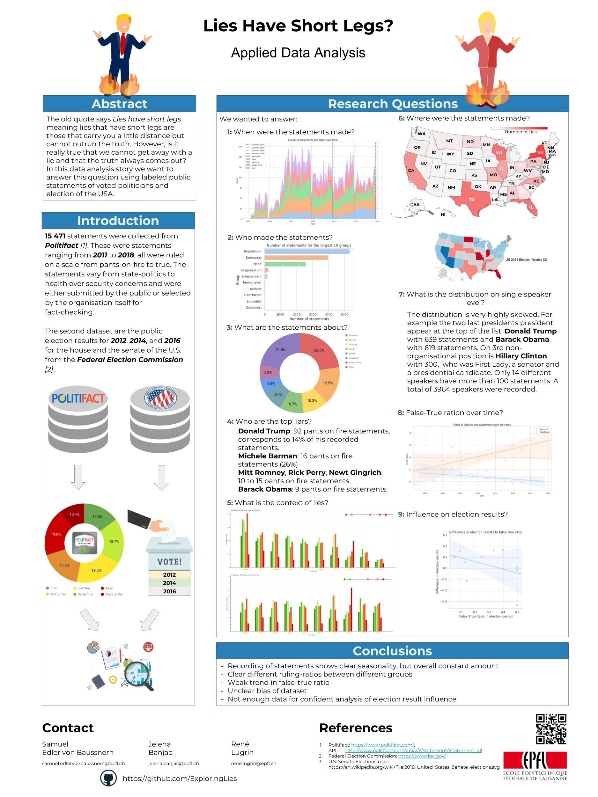

# Lies have short legs?
Project for CS-401 Applied Data Analysis Course at EPFL

# Poster 

# Data Story website
<a href="https://exploringlies.github.io/lies-have-short-legs/"> Website </a>

# Abstract
The old quote says _Lies have short legs_ meaning lies that have short legs are those that carry you a little distance but cannot outrun the truth. However, is it really true that we cannot get away with a lie and that the truth always comes out?  

In this project, we will explore dataset collected from [POLITIFACT website](politifact.com) which includes 15 471 short statements labeled for truthfulness, speaker, party, context, dates, and other relevant information. Moreover, we will combine our dataset with election results collected from [US Election Atlas](https://uselectionatlas.org/) to enrich our insights.  

With this information, the project idea is to analyze what happens to politicians that lie and whether there is some trend that is followed. Our data story would include findings related to the nature of the relationship between politicians that lie and how it affects their job description, e.g. they are voted out from the office. In addition, we would like to compare the places in time where the lies where made, to identify a possible seasonality.  

We hope to give people an insight on whether lying will be fairly treated.  

# Research questions
Here are the research questions we would like to address during the project:  
- **Number of lies per politicians or speaker**  
geojson->statement_info/speaker/total_count and true count

- **Evolution during time of lies (in percentage compared to the statements)**  
geojson/statement_info/statement_date
take the proportion of lies compared to all statements with a moving window or a hist plot

- **Who are the biggest liars (people/groups/context)**  
group by statement_info/speaker/id and first_name and last_name

- **How do politicians behave, are lies part of their politics?**  
Select politicians (column5), number of lies (count(where column2 is a lie)), number of sentences in total (count all lines grouped by column5)

- **When do they lie? Do they lie before elections?**  
Data needed: number of lies, number of sentence, dates, date of election

- **Is there a correlation between politicians being voted out of office and their lies?**  
politicians voted out, date, number of lies, number of sentences.

- **Do politicians coming from different states lie more?**  
countries (states column 7), politicians (column 6), 

- **Do they lie more when doing federal vs state politics?**  

- **Are they parties who lies more?**  
statement_info/speaker/party/party or id

# Dataset
The dataset we will use is a public dataset about fake-news containing around 12 thousand statements making it sufficiently large to perform analysis on it. It was produced from [POLITIFACT website](politifact.com), a website reporting on the accuracy of statements made by people involved in U.S. politics. These data were gathered by William Yang Wang from the Department of Computer Science University of California for the purpose of automatic fake news detection.
Data are stored in 3 distinct files used for machine learning algorithms aiming at identifying truthfulness of news. They are the training, test and validation sets. These files are stored in a tab-separated values (TSV) format. They contain all the same structure and have the following attributes:

- Column 1: the ID of the statement (`[ID].json`), ex.: `2255.json`, the JSON keys received in this API call can be seen [here](http://jelenabanjac.com/lies-have-short-legs/data_insight/index.html).
- Column 2: the label, ex.: `barely-true`
- Column 3: the statement, ex.: `Mark Sharpe has lowered property taxes by 17 percent.`
- Column 4: the subject(s), ex.: `candidates-biography,taxes`
- Column 5: the speaker, ex.: `mark-sharpe`
- Column 6: the speaker's political career , ex.: `Hillsborough County commissioner`
- Column 7: the state info, ex.: `Florida`
- Column 8: the party affiliation, ex.: `republican`
- Column 9-13: the total credit history count, including the current statement, ex.: `1 / 0 / 0 / 0 / 0`
- Column 14: the context (venue / location of the speech or statement), ex.: `a campaign mailer`

To sum it up, we have a list of statements that are labeled according to their truthfulness from defined politicians whom we know their political career. Knowing that we have a decade of data, it enables us to analyse the relation between lies and job title. The Politifact API will provide us more details on the names, places, etc. 

In addition, we will combine our dataset with election results collected from [US Election Atlas](https://uselectionatlas.org/) to enrich our insights and hopefully have a success in answering our research questions.

# A list of internal milestones

[Trello board link](https://trello.com/b/o7QjOiJj/applied-data-analysis)

### Milestone 1: Data collection and wrangling
**Deadline**: November 11th
- fully understand the given dataset with a preliminary data analysis
- collect and identify more related data, e.g. voter turnouts, election results, population statistics
- define and set research questions

### Milestone 2: Detailed data analysis (start)
**Deadline**: November 18th
- analysis of data (just the train/test/validation sets not including ones from web scraping)
- changing and adding new research questions

### Milestone 3: Detailed data analysis
**Deadline**: November 25th (_Global Milestone 2_)
- analysis of data (including ones from web scraping)
- connecting LIAR dataset with the new one containing elections
- changing and adding new research questions
- the project repo contains two notebooks, with data collection and descriptive analysis  
- the notebook ends with a more structured and informed plan for what comes next (all the way to a plan for the presentation) - these sections of the notebook should be filled in by _Global Milestone 3_.  

### Milestone 3: Data Story and Visualization (start)
**Deadline**: December 2nd
- finishing up the data analysis tasks in the notebooks, adding plots of the foundings
- adding map visualizations
- creating a website
- brainstorming design requirements
- brainstorming the story flow
- creating initial scatches of data story

### Milestone 3: Data Story and Visualization
**Deadline**: December 9th
- notebook final touches
- implementing the initial version of visualization
- writing explainations of the visualizations and our foundings

### Milestone 4: Conclusion with data story
**Deadline**: December 16th (_Global Milestone 3_)
- data story on a GitHub pages
- writing conclusion
- the final notebook (continuation of _Global Milestone 2_).

### Milestone 5: Poster and presentation
**Deadline**: January  (_Global Milestone 4_)
- presentation of posters and (optionally) whatever else tickles your fancy (e.g., on-screen demos)  

# For TAs  
_Fixes_:
- We enrich our insights with additional dataset regarding election results and collect statements
- We checked LIAR dataset itself, together with statemets available through the API. In addition, we joined only the data we consider useful from this dataset with the one from US elections dataset. More details can be found in the notebooks.
- Meaning of 'job description of a politician' in the abstract is hopefully clarified.
- We fixed our research questions and hope they are more realistic and achievable now.

# References
- Paper: William Yang Wang, "Liar, Liar Pants on Fire": A New Benchmark Dataset for Fake News Detection, to appear in Proceedings of the 55th Annual Meeting of the Association for Computational Linguistics (ACL 2017), web: [https://arxiv.org/pdf/1705.00648.pdf](https://arxiv.org/pdf/1705.00648.pdf),  short paper, Vancouver, BC, Canada, July 30-August 4, ACL.
- Dataset link: [https://www.cs.ucsb.edu/~william/data/liar_dataset.zip](https://www.cs.ucsb.edu/~william/data/liar_dataset.zip)
- Github dataset link: [https://github.com/nishitpatel01/Fake_News_Detection/tree/master/liar_dataset](https://github.com/nishitpatel01/Fake_News_Detection/tree/master/liar_dataset)
- Website: [https://www.cs.ucsb.edu/~william/software.html](https://www.cs.ucsb.edu/~william/software.html)
- Politifact API: [https://www.politifact.com//api/v/2/statement/11685/?format=json](https://www.politifact.com//api/v/2/statement/11685/?format=json)
