
<link rel="shortcut icon" type="image/png" href="images/favicon.jpg"/>

<link rel="stylesheet" href="https://cdn.jsdelivr.net/gh/fancyapps/fancybox@3.5.6/dist/jquery.fancybox.min.css" />

# Lies have short legs
## Project for CS-401 Applied Data Analysis Course at EPFL

The old quote says _Lies have short legs_ meaning lies that have short legs are
those that carry you a little distance but cannot outrun the truth. However, is
it really true that we cannot get away with a lie and that the truth always
comes out? In this report we want to answer this question by analysing public statements
of voted politicians in the USA.

For this we collected **15 471** statements from
[politifact](https://www.politifact.com/). These were statements ranging from
2011 to 2018, all were ruled on a scale from *pants-on-fire* to *true*. The
statements vary from state-politics to health over security concerns and were
either submitted by the public or selected by the organisation itself for
fact-checking. The second dataset are the public election results for 2012,
2014, and 2016 for the house and the senate of the U.S. from the [Federal Election Commission](https://transition.fec.gov/pubrec/electionresults.shtml).

## Understanding the statements

Each statement was judged by a journalist based on [primary and public
sources](https://www.politifact.com/truth-o-meter/article/2018/feb/12/principles-truth-o-meter-politifacts-methodology-i#Our%20sourcing),
and later rechecked by three editors, the assigned label comes on a [scale of six values](https://www.politifact.com/truth-o-meter/article/2018/feb/12/principles-truth-o-meter-politifacts-methodology-i#Truth-O-Meter%20ratings):

- **TRUE**: The statement is accurate and there’s nothing significant missing.
- **MOSTLY TRUE**: The statement is accurate but needs clarification or additional information.
- **HALF TRUE**: The statement is partially accurate but leaves out important details or takes things out of context.
- **MOSTLY FALSE**: The statement contains an element of truth but ignores critical facts that would give a different impression.
- **FALSE**: The statement is not accurate.
- **PANTS ON FIRE**: The statement is not accurate and makes a ridiculous claim.

We scraped the API of Politifact, [example API call](http://www.politifact.com/api/v/2/statement/99/?format=json) in order to collect as many data points as possible.

<a data-fancybox="gallery" href="images/label_counts_overall.png">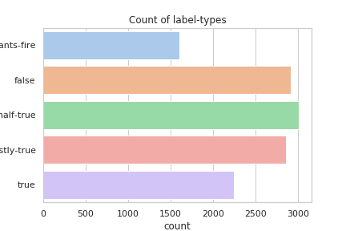</a>

As can be seen, the label `mostly false` does not occur in our dataset. The
labels seem to follow a normal distribution with a centre around `half-true`.

<a data-fancybox="gallery" href="images/labels_over_years.png">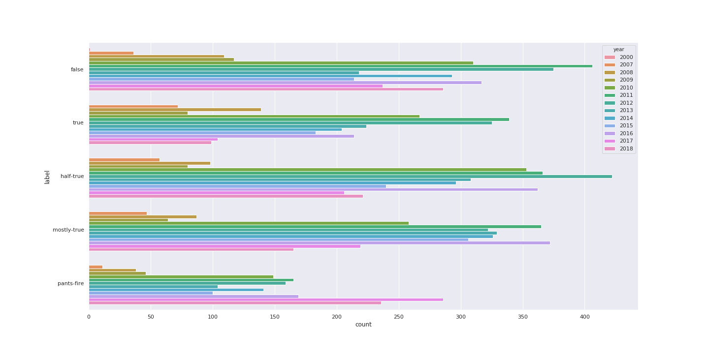</a>

The distribution of labels over the years reflects the general amount of data for these years.

## When were these statements made?

<a data-fancybox="gallery" href="images/ratio_false_true_parties.png">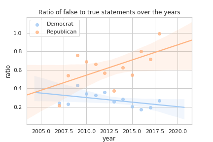</a>

Here we compare the false statements (pants on fire and false) with true statements (all the other statements). We observe that this ratio of false-to-true statements for democrats goes slightly downwards, but for Republicans the ratio is on a steep climb.

## Who makes these statements?

The distribution of statements per group (this can be a party, a general
organisation, a journalist, ...) shows that overall more statements from
republicans were fact-checked. This could indicate a potential bias, but
without knowing the complete number of statements made this is not enough to
say that this source is biased.

<a data-fancybox="gallery" href="images/nb_simple_rulings_for_major_parties.png">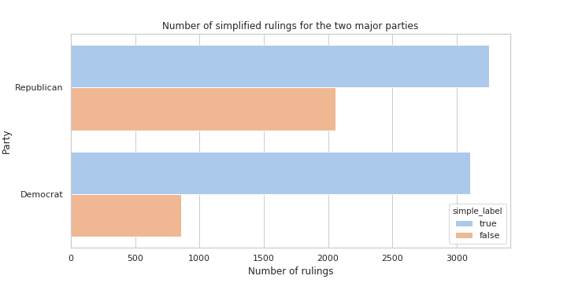</a>

Given the rulings themselves we can clearly see that Republicans lie more (38%
vs 21%). Both parties have roughly the same amount of true statements (3255 and
3105 for the Republicans and the Democrats respectively).

## What are the statements about?

The importance of the different political subjects varies. Most common subject
turns out to be economy with nearly **3500** statements. The second one appears
to be politics with nearly **2400** statements. Security has **1600**
statements. We have **1500** statements related to family, **1300** to health,
**900** to immigration, **900** to environment. We can observe that all these
subjects are recurrent in politics. Economy seems to be particularly prominent
in these statements. This might possibly reflect politics priorities.

## On the source and quality of the statements

PolitiFact [started in
2007](https://www.politifact.com/truth-o-meter/article/2018/feb/12/principles-truth-o-meter-politifacts-methodology-i/)
and describes itself as a "not-for-profit" organisation and is [owned by](https://www.politifact.com/truth-o-meter/article/2018/feb/12/principles-truth-o-meter-politifacts-methodology-i/#Our%20ownership) the [Poynter Institute for Media Studies](https://www.poynter.org/), but relies primarily on the financial support from the [Tampa Bay Times](http://www.tampabay.com/).
Donations exceeding $1'000 are [publicly listed](https://www.politifact.com/truth-o-meter/blog/2011/oct/06/who-pays-for-politifact/). Around one third of the statements were [suggested by readers](https://www.politifact.com/truth-o-meter/article/2018/feb/12/principles-truth-o-meter-politifacts-methodology-i/). [PolitiFact won the Pulitzer Price for National Reporting in 2009](https://web.archive.org/web/20090919173210/http://www.pulitzer.org/citation/2009-National-Reporting).

In order to evaluate a possible bias better we looked at the rulings of each
journalist. In total 368 journalists made judged statements, 43 of those made
up 80% of all rulings.  Looking at how these journalists rule based on the
ratio between false and true statements we observed a significant difference:
60.1% for Republicans and 16.8% for Democrats, meaning that Republicans had a
much higher likelihood to be judged to lie. We again stress the point, that
this is does not necessarily indicate a potential bias, as we lack ground
truth.

<a data-fancybox="gallery" href="images/ratio_comparision_author_basis.png">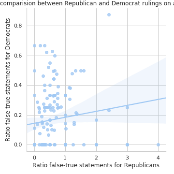</a>

The ratio is however very drastic and underlines more the selection bias of
statements, the statements were probably not randomly selected. Instead the
selection is biased towards what the organisation deemed to be newsworthy. The
ratio of lies could therefore lie much lower.

Based on this we deem the source to somewhat reliable but also biased, but not
biased enough to not consider the data valuable and insightful.

## Number of statements per speaker

<!--  -->

The number of statements per speaker is not uniform. For example the two last
presidents president appear at the top of the list: Donald Trump with **639**
statements and Barack Obama with **619** statements. 3rd place comes to Hillary
Clinton, who was First Lady, a senator and a presidential candidate. In the top
10 we have people having more than **100** statements. This number decreases
drastically for the remaining **300** other people.

## The evolution of lies during time?

<a data-fancybox="gallery" href="images/statement_years_count.png">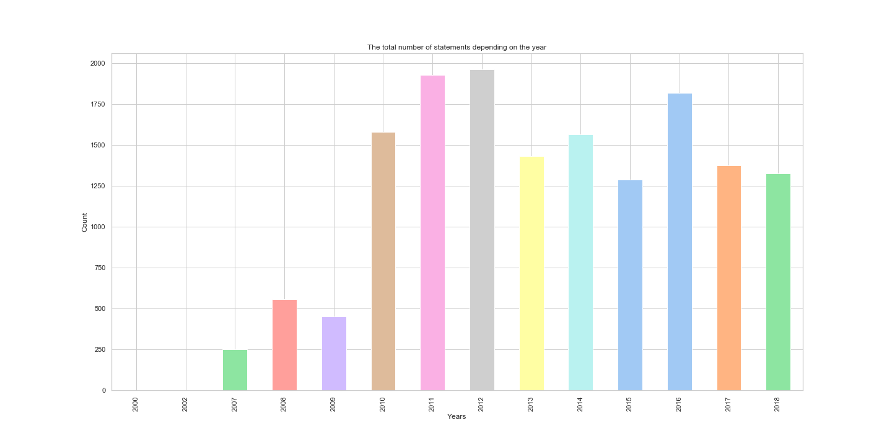</a>

Variations of number of lies is visible across the years. At the beginning of
PolitiFact lies are the rarest with 250 lies in 2007. This also corresponds to
a lower total number of statements. Moreover, two peaks can be observed. The
first one occurs in 2012 with 2000 lies and the second one occurs in 2016 with
1800 lies. Both peaks correspond to U.S. presidential elections when politics
are at their peak of activity.

## Who are the biggest liars

We consider as big liar a person who is reported to lie often with respect to
the PolitiFacts data gathered. Under these conditions the biggest liar is the
current U.S. president Donald Trump with **92 pants on fire** statements. It
corresponds to **14%** of his recorded statements. Michele Barman has a even
higher pants on fire percentage of **26%** for a total of **16** pants on fire
statements. She is a member of the Republican Party and is a former member of
the United States House of Representatives. Other politicians worth mentioning
are Mitt Romney, Rick Perry or Newt Gingrich with 10 to 15 pants on fire
statements. The former U.S.  president Barack Obama has **9** pants on fire,
but it represents a proportion of an order of magnitude lower than for Donald
Trump.

## When do they lie?

### Top lying year is ...
The total distribution of statements over the years:

<a data-fancybox="gallery" href="images/statement_month_count.png">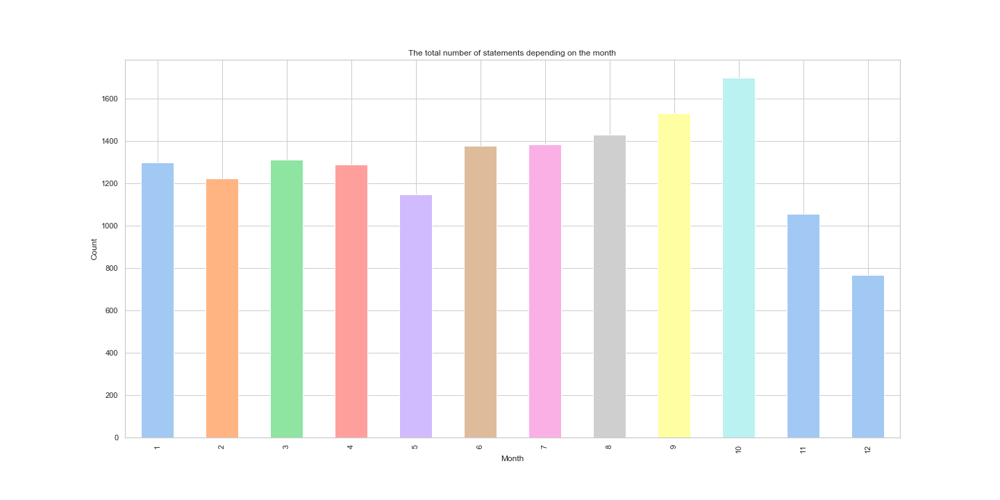</a>

From the plot we observe that the biggest number of statements from this
dataset was collected during 2012. Small oscillation in the years 2012, 2014,
2016 represent also local maxima, which can be explained by the occurrence of
elections were held in these years.

Looking at the distribution of rulings for each year:

<a data-fancybox="gallery" href="images/statement_years_count_with_labels.png">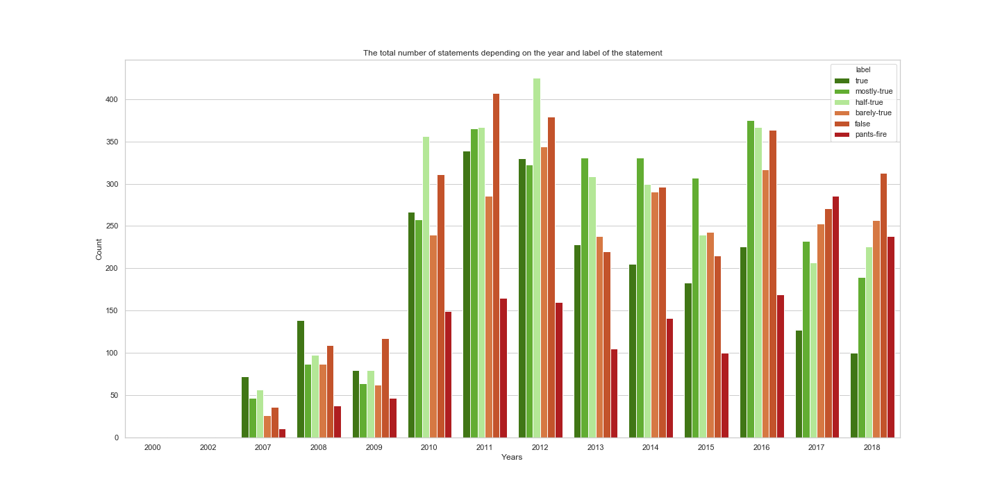</a>

From this plot we can notice that statements ruled as _pants on fire_ had the
highest count in 2017. On the other hand, the number of _true_ statements was
the highest during 2011. Please note that this is only the count of statements,
and it does not mean that politicians lied the most during 2017, as we don't
know the total number of statements made.

Therefore, let's see the proportion:

<a data-fancybox="gallery" href="images/statement_years_count_percentage.png">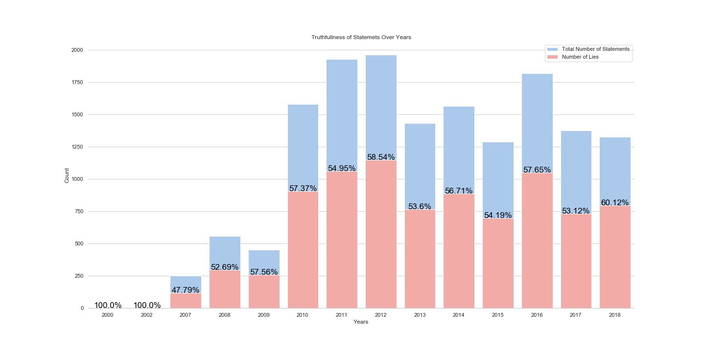</a>

From the plot we can notice that statements collected during the 2000 and 2002
were all negative/false ones. However, the number of collected statements in
that period is neglectable.

We also notice that the biggest proportion of false statements was
during 2012, around **58.54**. On the contrary, we can see that during 2007,
the proportion percentage of positive/true statements was greater than the
percentage of negative/false statements, around **47.79**.

Let's also see it normalized:

<a data-fancybox="gallery" href="images/statement_years_count_percentage_norm.png">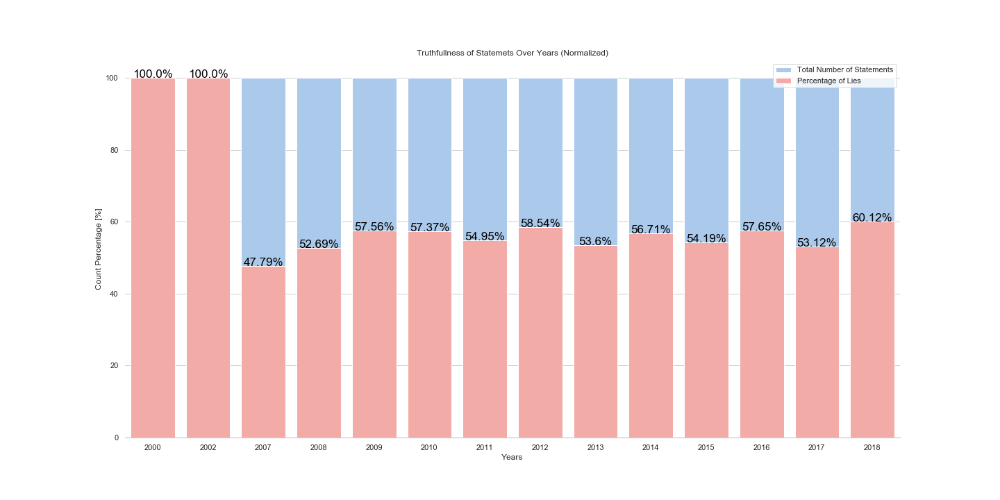</a>

**Answer: The top Lie year was 2012, and the Top Truth year was 2007!**

### Top lying month is ...

Let's find out during which months the number of false statements is the
biggest. False statements include statements that are _false_, _pants on fire_,
and _barely true_.

First, let's see the total count distribution of statements over the months.

From this plot we can see that the biggest number of statements is made during
the October, this reflects the fact that elections occur in November.

Now, it will be nice to see the count of statement labels during each month, to
see how many statements were positive (_true_, _mostly-true_, _half-true_) and
negative depending on the month. Labels are noted in the plot's legend.

<a data-fancybox="gallery" href="images/statement_month_count_with_labels.png">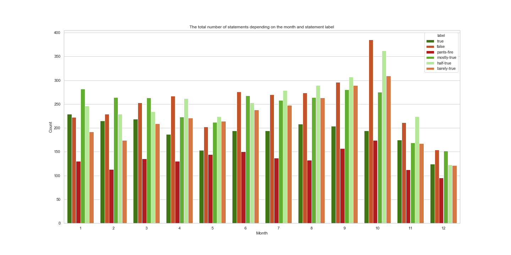</a>

From this plot, we can notice that the biggest number of false statements is
given during the October as well. In addition, the number of _pants on fire_
statements is also the biggest during the October. We should not conclude here
that politicians lie the most during the October. It is true that the number
of false statements during the October is the highest, but we should not forget
that also the total number of statements is also highest during this month.

Let's see the percentage of negative statements in comparison to the total
amount of statements given in that month.

<a data-fancybox="gallery" href="images/statement_month_count_percentage.png">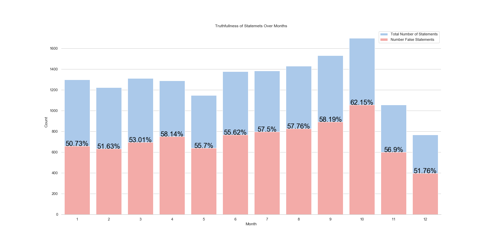</a>

And let's see it normalized:

<a data-fancybox="gallery" href="images/statement_month_count_percentage_norm.png">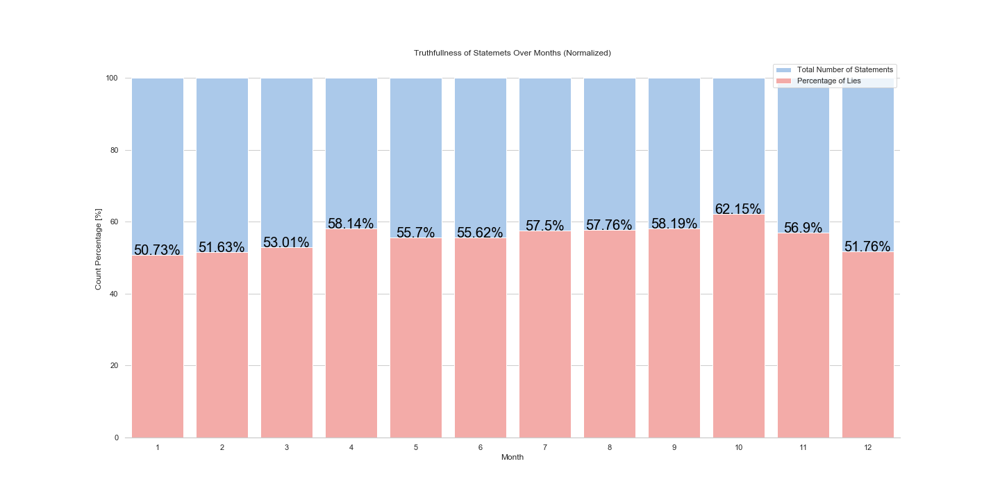</a>

In the end we see, that indeed the biggest number of negative statements is
given during the October, around **62.15 %**.

On the other hand, the biggest number of positive/true statements is given
during the January, around **50.73 %**.

It is interesting to see that there is no time where truth leads the game. The
number of negative/false statements is always at least 50% or above.

**Answer: The top Lie month is October, and the Top Truth month is January!**

### Top lying week-day is ...
Let's see during which week day we should not believe politician's statements.

The total count of statements is shown in the plot bellow:
<a data-fancybox="gallery" href="images/statement_weekday_count.png">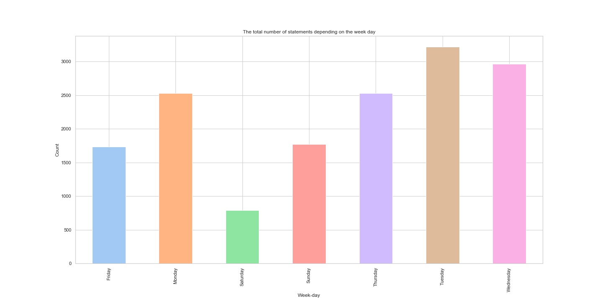</a>

Most statements are made on Tuesday, compared to Saturday where the least
statements are made.

And the statement counts with labels is:
<a data-fancybox="gallery" href="images/statement_weekday_count_with_labels.png">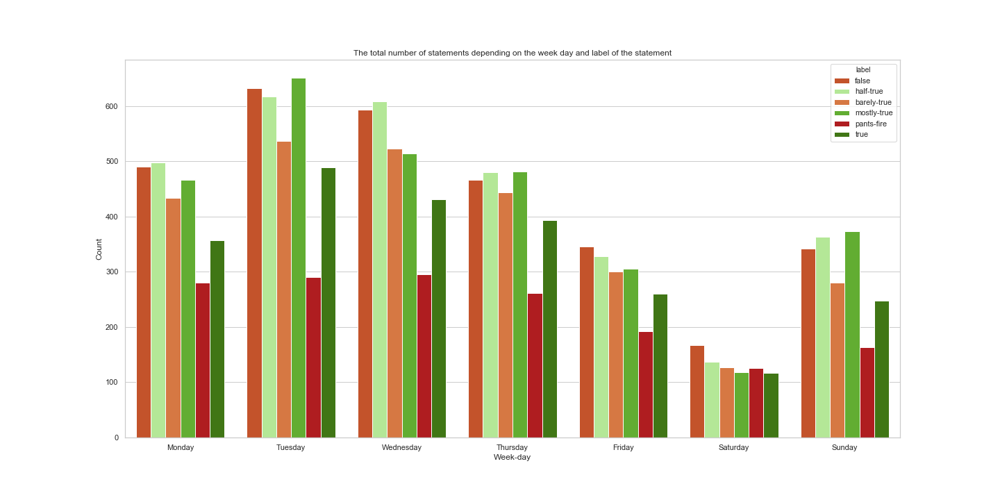</a>

We can see that the highest number of statement count with label _pants on
fire_ is on Wednesday. On the other hand, the biggest number of _true_
statements is on Tuesday.

But, let's not conclude anything before seeing the percentage:
<a data-fancybox="gallery" href="images/statement_weekday_count_percentage.png">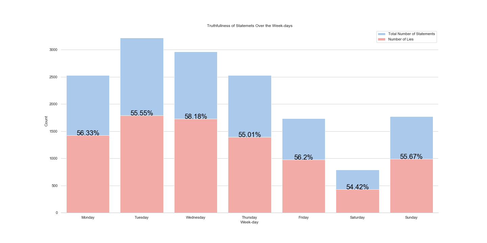</a>

and normalized plot:
<a data-fancybox="gallery" href="images/statement_weekday_count_percentage_norm.png">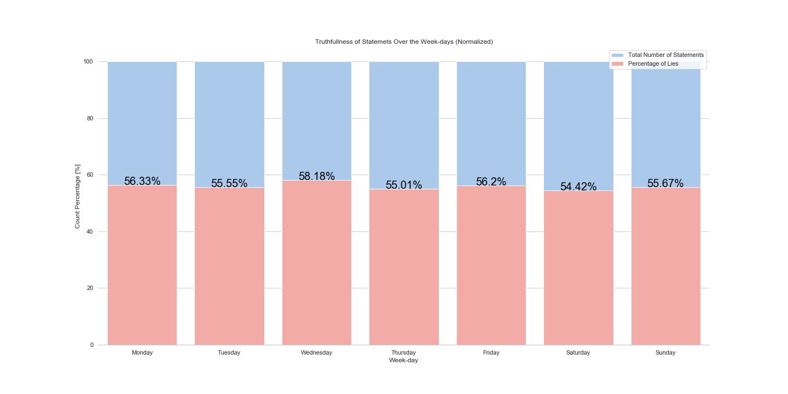</a>

These two plots show summed negative statements (_false_, _pants-on-fire_,
_barely true_) and we can see that the biggest number of false statements is
reported on Tuesday, however the proportionally bigger number of false
statements is given on Wednesday, around **58.18 %**. In addition, we can see
that during Saturday there is the least number of false statements, but also
the proportion of false statements is smallest, around **54.42 %**.

**Answer: The top Lie week-day is Wednesday, and the Top Truth week-day is Saturday!**

## Bringing in election data

The final results for the election in 2018 where not out at the time of
writing, therefore only the results for the elections in 2012 2014, and 2016
where used. In order to compare different behaviour we chose to compare
politicians from the house and congress during this period. There were 5653
different politicians with votes in this period. Since we are interested in the
effect of the statements on the voting results we need at least two periods.
This leaves us with 1110 politicians. The voting cycle for every position is
not the same, we considered all combinations as a valid combination as along as
there was data.

## Lying states?
Let's see the number of statements depending on the state. In which state there was the most number of statements given?
<a data-fancybox="gallery" href="images/map1.PNG">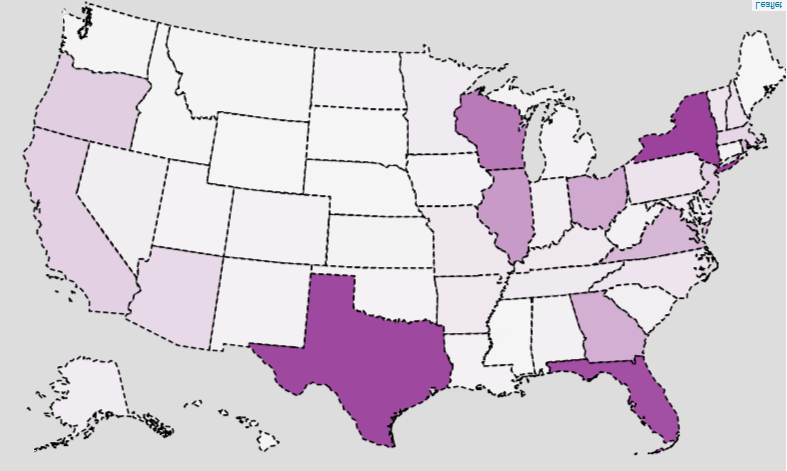</a>
We can see that the biggest number of statements was given in the Texas, New York, and Florida. But let's see what states have the higest number of false statements.

And now, what are the states in which the most number of negative/false statements (count) was given:

<a data-fancybox="gallery" href="images/map2.PNG">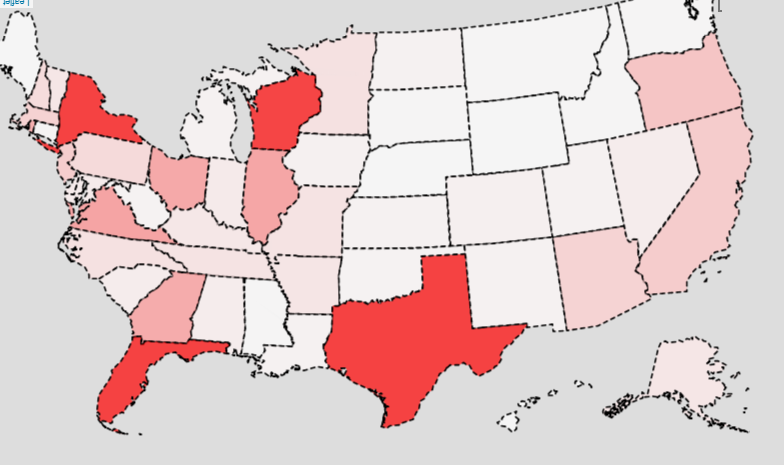</a>
From the map we can observe that in New York, Texas, Florida and Wisconsin was the higest number of false statements given.

These statements are given over the timespan from 2010 to 2018. But let's see the map of 2017-2018 statements and compare them with the map of U.S. election results map.

<a data-fancybox="gallery" href="images/us.PNG">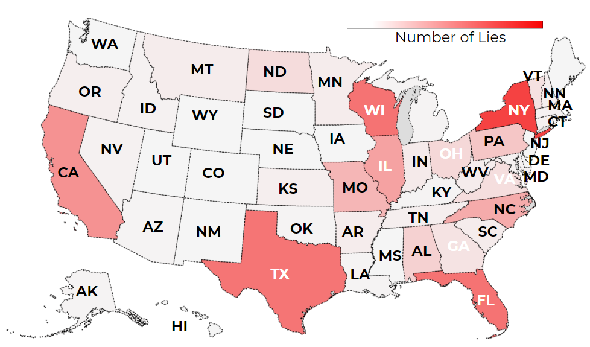</a>

And the U.S. senate election map is:

<a data-fancybox="gallery" href="images/800px-2018_United_States_Senate_elections.svg.png">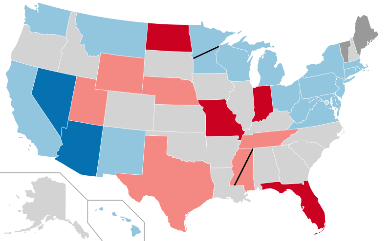</a>

## Context of Lying States?

On the following plot we can see how many statements belong to which type of context.

<a data-fancybox="gallery" href="images/stat_context.PNG">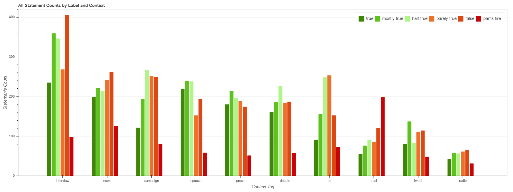</a>
From this plot we can observe that the highest number of statements was given in the context of **interview**. The next type of context is **news**, then **campaign**, **speech**, **press**, etc. We can also observe that the biggest number of negative statements was given during the interviews (when the red bars are summed up). On the other hand, if we observe the *pants on fire* label, then we can see that the posts contain biggest number of these statements. Note: post include blog posts, facebook posts, website posts, etc. But let's not jump to the conclusions. Let's see the proportion of these labeled statements within the context (see next plot). 

<a data-fancybox="gallery" href="images/stat_context-PERC.PNG">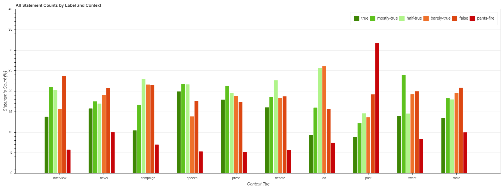</a>
In this plot we see that interviews are not that bad proportionally. Interesting thing to notice is that during speeches, polititians tend to say more postive statements than negative ones. However, posts, still lead in the count of negative statements, even when percentage is observed.

## Bringing in election data

The final results for the election in 2018 where not out at the time of
writing, therefore only the results for the elections in 2012 2014, and 2016
where used. In order to compare different behaviour we chose to compare
politicians from the house and congress during this period. There were 5653
different politicians with votes in this period. Since we are interested in the
effect of the statements on the voting results we need at least two periods.
This leaves us with 1110 politicians. The voting cycle for every position is
not the same, we considered all combinations as a valid combination as along as
there was data.

Combining the election results with the statements gives data for 48
politicians. Further requiring that some statements were made in both time
periods (two years prior to an election in the two-year cycle) reduces the
number to 5 politicians. For those five politicians we could build 10 data
points to compare the false-true-ratio to the election results:

<a data-fancybox="gallery" href="images/difference_election_results.png">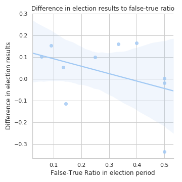</a>

Given the low number of matches found we would not advice to draw any
conclusions from these findings.

For these politicians we observed only one period in which an increase in the
false-true-ratio had a negative effect.

<a data-fancybox="gallery" href="images/difference_false_true_ratio_to_election_results.png">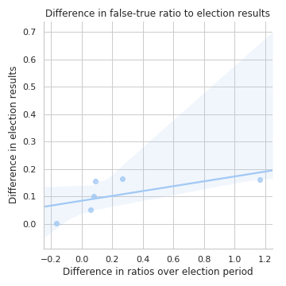</a>

## Conclusion

We observe a fairly constant lying over the years, with some differences in
when, who and where people lie. In a further work we would like to research in
which context lies are made more often. Do people lie more on Twitter or on TV?
A similar question could be asked about the position of the person: Do house
representatives lie more or less than senators. We estimate that the number of
statements for politicians who will be judged will increase, including the 2018
elections should therefore yield interesting results.

Estimating the bias of the dataset is a tricky question and should be
researched with greater care and more resources.

Answering the main research question was not possible given the limited amount
of statements for politicians. Including more sources such as [Fact
Checker](http://www.washingtonpost.com/news/fact-checker/) from the Washington
Post (which is not available in the EU and Switzerland without
IP-address-faking) would require more resources and were out-of-scope for this
report.
