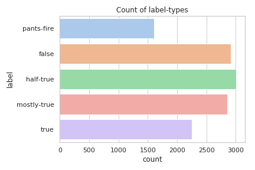

<link rel="stylesheet" href="https://cdn.jsdelivr.net/gh/fancyapps/fancybox@3.5.6/dist/jquery.fancybox.min.css" />

# Lies have short legs
## Project for CS-401 Applied Data Analysis Course at EPFL

The old quote says _Lies have short legs_ meaning lies that have short legs are
those that carry you a little distance but cannot outrun the truth. However, is
it really true that we cannot get away with a lie and that the truth always
comes out? In this report we want to answer this question by analysing public statements
of voted politicians in the USA.

For this we collected **15 471** statements from
[politifact](https://www.politifact.com/). These were statements ranging from
2011 to 2018, all were ruled on a scale from *pants-on-fire* to *true*. The
statements vary from state-politics to health over security concerns and were
either submitted by the public or selected by the organisation itself for
fact-checking. The second dataset are the public election results for 2012,
2014, and 2016 for the house and the senate of the U.S.

Before we the answer this question we want to show the content of the
statements in the form of answering the 5Ws: Who, What, When, Where and Why.
Since the question *Why were these statements made?* is not really answerable
with our data we omit this question.

## Understanding the statements

Each statement was judged by a journalist based on [primary and public
sources](https://www.politifact.com/truth-o-meter/article/2018/feb/12/principles-truth-o-meter-politifacts-methodology-i#Our%20sourcing),
and later rechecked by three editors, the assigned label comes on a [scale of six values](https://www.politifact.com/truth-o-meter/article/2018/feb/12/principles-truth-o-meter-politifacts-methodology-i#Truth-O-Meter%20ratings):

- **TRUE**: The statement is accurate and there’s nothing significant missing.
- **MOSTLY TRUE**: The statement is accurate but needs clarification or additional information.
- **HALF TRUE**: The statement is partially accurate but leaves out important details or takes things out of context.
- **MOSTLY FALSE**: The statement contains an element of truth but ignores critical facts that would give a different impression.
- **FALSE**: The statement is not accurate.
- **PANTS ON FIRE**: The statement is not accurate and makes a ridiculous claim.

We scraped the API of Politifact, [example API call](http://www.politifact.com/api/v/2/statement/99/?format=json) in order to collect as many data points as possible.

As can be seen the label `mostly false` does not occur in our dataset. The
labels seem to follow a normal distribution with a centre around `half-true`.

The distribution of labels over the years is reflects the general amount of data for these years. **TODO check this with a better plot**

## When were these statements made?

We observe that the ratio of false-to-true statements for democrats goes slightly downwards, but for Republicans the ratio is on a steep climb.

**TODO**

## Who makes these statements?

The distribution of statements per group (this can be a party, a general
organisation, a journalist, ...) shows that overall more statements from
republicans were fact-checked. This could indicate a potential bias, but
without knowing the complete number of statements made this is not enough to
say that this source is biased.

Given the rulings themselves we can clearly see that Republicans lie more (38%
vs 21%). Both parties have roughly the same amount of true statements (3255 and
3105 for the Republicans and the Democrats respectively).

**TODO**

## What are the statements about?

**TODO**

## Where were these statements made?

**TODO**

## Bringing in election data

**TODO**

## On the source and quality of the statements

PolitiFact [started in
2007](https://www.politifact.com/truth-o-meter/article/2018/feb/12/principles-truth-o-meter-politifacts-methodology-i/)
and describes itself as a "not-for-profit" organisation and is [owned by](https://www.politifact.com/truth-o-meter/article/2018/feb/12/principles-truth-o-meter-politifacts-methodology-i/#Our%20ownership) the [Poynter Institute for Media Studies](https://www.poynter.org/), but relies primarily on the financial support from the [Tampa Bay Times](http://www.tampabay.com/).
Donations exceeding $1'000 are [publicly listed](https://www.politifact.com/truth-o-meter/blog/2011/oct/06/who-pays-for-politifact/). Around one third of the statements were [suggested by readers](https://www.politifact.com/truth-o-meter/article/2018/feb/12/principles-truth-o-meter-politifacts-methodology-i/).

## Research questions Here are the research questions we would like to address
during the project:
- **Number of lies per politicians or speaker**
geojson->statement_info/speaker/total_count and true count

- **Evolution during time of lies (in percentage compared to the statements)**
geojson/statement_info/statement_date take the proportion of lies compared to
all statements with a moving window or a hist plot

- **Who are the biggest liars (people/groups/context)**
group by statement_info/speaker/id and first_name and last_name

- **How do politicians behave, are lies part of their politics?**
Select politicians (column5), number of lies (count(where column2 is a lie)),
number of sentences in total (count all lines grouped by column5)

- **When do they lie? Do they lie before elections?**
Data needed: number of lies, number of sentence, dates, date of election

- **Is there a correlation between politicians being voted out of office and
- their lies?**
politicians voted out, date, number of lies, number of sentences.

- **Do politicians coming from different states lie more?**
countries (states column 7), politicians (column 6),

- **Do they lie more when doing federal vs state politics?**

- **Are they parties who lies more?**
statement_info/speaker/party/party or id

# References
- Paper: William Yang Wang, "Liar, Liar Pants on Fire": A New Benchmark Dataset
- for Fake News Detection, to appear in Proceedings of the 55th Annual Meeting
- of the Association for Computational Linguistics (ACL 2017), web:
- [https://arxiv.org/pdf/1705.00648.pdf](https://arxiv.org/pdf/1705.00648.pdf),
- short paper, Vancouver, BC, Canada, July 30-August 4, ACL.  Dataset link:
- [https://www.cs.ucsb.edu/~william/data/liar_dataset.zip](https://www.cs.ucsb.edu/~william/data/liar_dataset.zip)
- Github dataset link:
- [https://github.com/nishitpatel01/Fake_News_Detection/tree/master/liar_dataset](https://github.com/nishitpatel01/Fake_News_Detection/tree/master/liar_dataset)
- Website:
- [https://www.cs.ucsb.edu/~william/software.html](https://www.cs.ucsb.edu/~william/software.html)
- Politifact API:
- [https://www.politifact.com//api/v/2/statement/11685/?format=json](https://www.politifact.com//api/v/2/statement/11685/?format=json)
